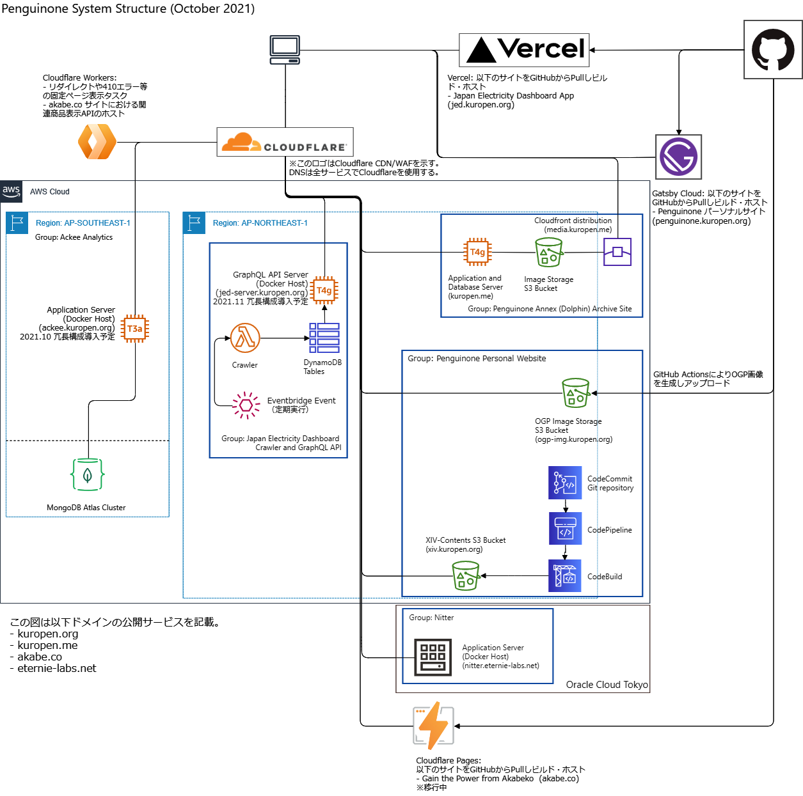

This website is Kuropen's personal website which contains blog, technical articles and game-related article.

### Disclaimers about contents
All contents on this website reflect my personal opinion, not any company or group I belong to.

Posts aim to provide information are provided as-is, and not guaranteed.
Despite I take care not to provide, inaccurate information may be included.
Please use such information at your own risk.

I am responsible all information on this website. Please don't contact any other entities mentioned on this website.

### Copyright notice
All contents on this website is licensed under [Creative Commons Attribution-NonCommercial-ShareAlike 4.0](https://creativecommons.org/licenses/by-nc-sa/4.0/), 
unless otherwise noted.

### Checked environment
This website and related website is checked with following environments.
This does not mean that this website is guaranteed to work on following environments.

Note: This website is not, and will never be, tested on Internet Explorer.

- Chromium-based browsers (Edge[^1], Brave, Vivaldi, Chrome, and so on)
   - Windows 10 PC with 1920x1080 display
   - Android 11 smartphone (Samsung Galaxy S20+)
- Safari and compatible browsers
   - iPad mini, 5th generation, with iOS 14

[^1]: Chromium-based one with skyblue icon only. Do not use EdgeHTML one with blue icon since it is no longer supported.

### Contact information
Contact information is written on [Profile Page](/en/profile).

### Privacy Policy
[Privacy Policy is here.](/en/privacy)

### Domains controlled by the author
The author of this website owns following domain.

- kuropen.org
- kuropen.me
- eternie-labs.net
- akabe.co

All websites on domains above are HTTPS-only. HTTP protocol communications are redirected.

### Server environments

- Current Webpage since July 2021
   - Hosting: [Vercel](https://vercel.com/) [^2]
   - HTML Generator: [Gatsby](https://www.gatsbyjs.com/)
   - Data Management: [GitHub](https://github.com/kuropen/penguinone) [^3]

[^2]: For some contents, Amazon S3 used for copyright protection.

[^3]: For some contents, AWS CodeCommit used for copyright protection.

### Components used for this website
- Web fonts
   - [Orbitron](https://www.theleagueofmoveabletype.com/orbitron)
   - [Noto](https://fonts.google.com/noto)
   - [IBM Plex Sans JP](https://github.com/IBM/plex) [^4]
- [MUI](https://mui.com/)
- [Simple React Lightbox](https://simple-react-lightbox.dev/)

[^4]: Used for open graph image. Not used in web page.
