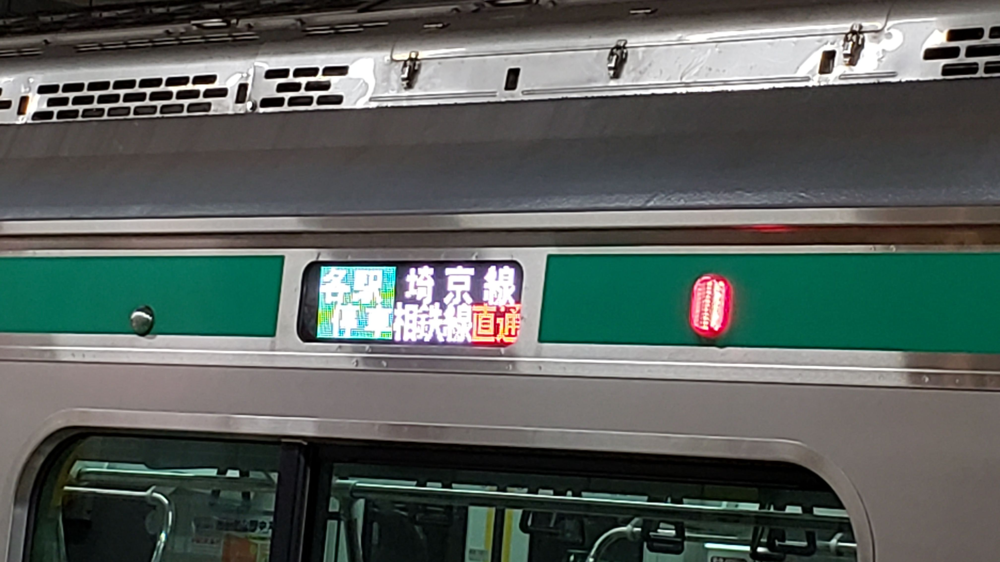

2019年11月30日に埼京線はダイヤ改正があった。

武蔵浦和以北での快速停車駅変更や減便などという発表で物議を醸していたが、実際にはさいたま市内区間でも一部の駅を除いては利便性が向上する改正だった。

この記事ではさいたま市内区間でのダイヤ改正のポイントについて見ていく。なお参考までに、筆者の最寄り駅は与野本町駅である。

### 快速停車駅変更による効果
物議を醸している快速停車駅の変更だが、それによって以下の効果が発生している。

#### 昼間・夜間の列車間隔均等化

朝ラッシュ時以外は、上下線とも、武蔵浦和駅まで各駅に停車する列車が10分間隔で到着するダイヤになっている。

さいたま市内では、他に京浜東北線とニューシャトルがこの形態のダイヤになっている。 また武蔵野線も、貨物列車などの関係で1～2分程度不均一になる場合があるが概ね同様の考え方でダイヤ編成がされている。

これまでの埼京線は1時間に9本の運行がされていたが、列車間隔は不均等で、駅に到着する時間帯によって列車に乗るまでの待ち時間が大幅に変わっていた。

快速停車駅であった与野本町駅でさえ、時間帯によって5分待ちの場合もあれば10分待ちの場合もあった。

快速通過駅の中浦和・南与野・北与野を発着する場合はさらに深刻で、快速通過の時間帯にあたってしまえば最大16分の待ち時間が発生していた。 この3駅に関して言えば実際に乗れる列車の本数は6本のまま変わっていないので、特にデメリットのある改正ではなく、むしろ列車に乗るまでの待ち時間が減少している。

#### 日中の中浦和・南与野・北与野から川越線と渋谷以南が乗換不要に
埼京線の日中ダイヤは、

- 川越 - 新木場間の快速
- 大宮 - 新宿間の各駅停車
の2系統で構成されている。この枠組みは、後者が一部武蔵浦和発着となったことを除いて、今回の改正でも変わっていない。

中浦和・南与野・北与野の3駅はこれまで快速が停車しなかったため、川越線内と渋谷以南に行く場合は必ず乗換を要していたが、2本に1本は乗換不要となった。

1985年、今を遡ること34年前の埼京線開業当時、当時の与野市内で快速の停車駅は与野本町とされた。 しかし与野本町駅周辺は行政の中心ではあるものの旧市街で開発の伸びしろは少なく、現在も観光地として彩の国さいたま芸術劇場や与野公園を擁する以外は低層住宅地が広がっている。

埼京線開業前から日本最古とされるタワーマンション「与野ハウス」が立地し、埼京線開業後に「アルーサ北与野」「さいたま新都心」などの再開発事業が次々と施行された北与野駅や、 埼玉大学の最寄り駅として学生の利用が多く、現在も区画整理の進む南与野駅のほうが、普通の鉄道会社にとっては重視されるべき存在なのは明らかであり、 今回のダイヤ改正はそれを反映したものと見ることもできよう。

### 平日夜間の「赤羽止まり」の減少
これまで平日の18時台・19時台にあった赤羽止まりはなくなっている。 この時間帯は全列車が武蔵浦和駅まで行くようになり、通勤快速は武蔵浦和駅で各駅停車に対面乗換できるダイヤとなった。

実際に平日18時台に赤羽止まりの後続を走る各駅停車に乗ると、先行列車が赤羽駅で乗客を降ろし留置線に入るまでに後続列車が機外停止するケースが多かったので、 この状況の改善により乗客のフラストレーション軽減には繋がるだろう。 また、通勤快速利用時に武蔵浦和駅のホームで後続を待つケースが少なくなったというのも、これからの季節には嬉しい話である。

なお、平日20時台以降に関しては、赤羽止まりもあるし、通勤快速から武蔵浦和で各駅停車に乗り換えるときに武蔵浦和駅のホームで待つ必要があるが、 一方でこれまで平日の20時台以降は新宿駅始発の列車が主に通勤快速とされていたところ、各駅停車に変更になっているので、 そこまで遅い時間帯まで仕事をしていたならばゆっくり座って帰ろう、ということにもなると思われる。

### 問題視される悪影響とは何か
今回のダイヤで、僅かでも利便性が低下したと言うことのできるケースがあるとすれば、 「大宮駅と与野本町駅の間、またはこれら2駅から東京方面を利用していた」ケースで列車を待つ時間が増える可能性があるくらいだろう。

ただし、その与野本町駅の利用者である筆者からして見れば、むしろ列車に乗るために自宅を出る時間を見積もりやすくなるというプラスの影響しか見えないのだが。

長時間の列車待ちが軽減されることで、逆に、さいたま市中央区・桜区および南区の大多数の住民にとっては利便性向上になっている。

#### 問題視しているのは誰か
10月5日に、扶桑社のハーバー・ビジネス・オンラインに[埼京線の減便を問題視する記事](https://hbol.jp/203334)が掲載された。

この記事はライターがさいたま市北区選出の市議会議員・吉田一郎氏に取材したという記事であり、氏の主張をほぼ全面的に採用した記事になっている。 が、実際に与野本町駅を利用している筆者から見れば、あまりにも事実誤認が激しいと思わせられる記事だった。

その理由として

- 昼間時間帯の減便が発表されたのに朝ラッシュ時の混雑に絡めている
- 人口や駅の利用者数が増加したことを根拠に昼間時間帯の減便に反対しているが、ラッシュ時の利用者が増えただけかも知れないことを考慮していない
- 快速が通過していた各駅に関しても利便性が低下すると言い切ってしまっている

しかし、今にして思うと、これは発言の主が[吉田一郎氏](https://ja.wikipedia.org/wiki/%E5%90%89%E7%94%B0%E4%B8%80%E9%83%8E)であることがポイントだと考えるようになった。 吉田氏は**浦和・大宮・与野の3市合併に反対し、さいたま市の一部となった旧大宮市の再置を掲げる人物**である。すなわち、単に**大宮の論理を振りかざしただけ**とみることもできなくない。

浦和・与野地域にとっては利便性が向上する可能性があるものを、大宮の論理で利便性低下と言い切ってしまうあたりはいただけないと思う。