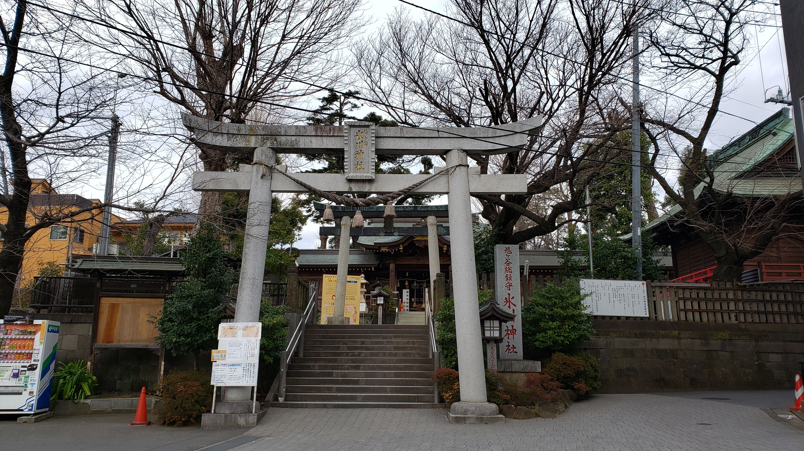
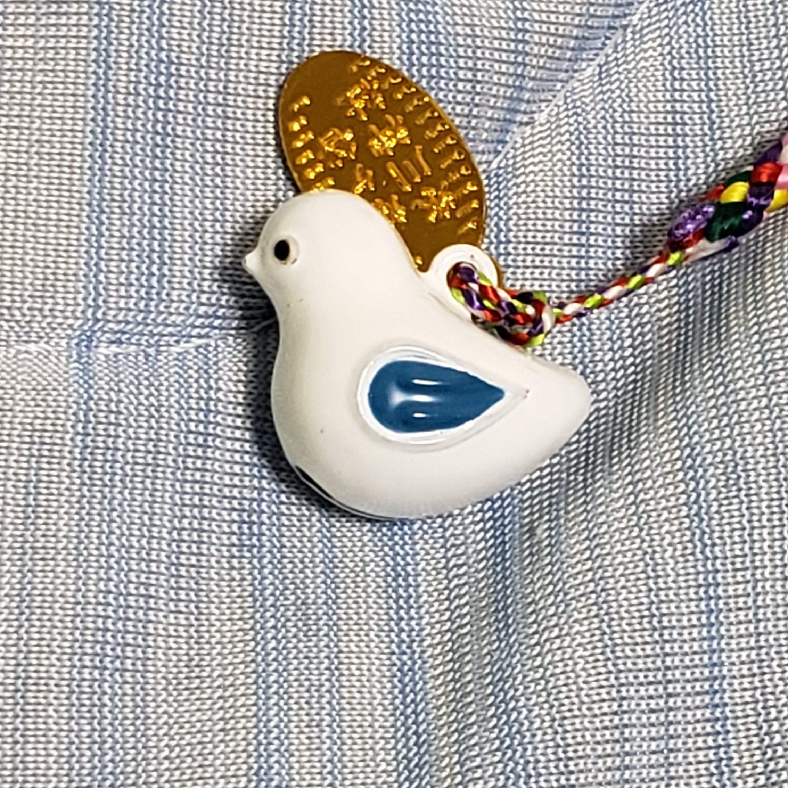
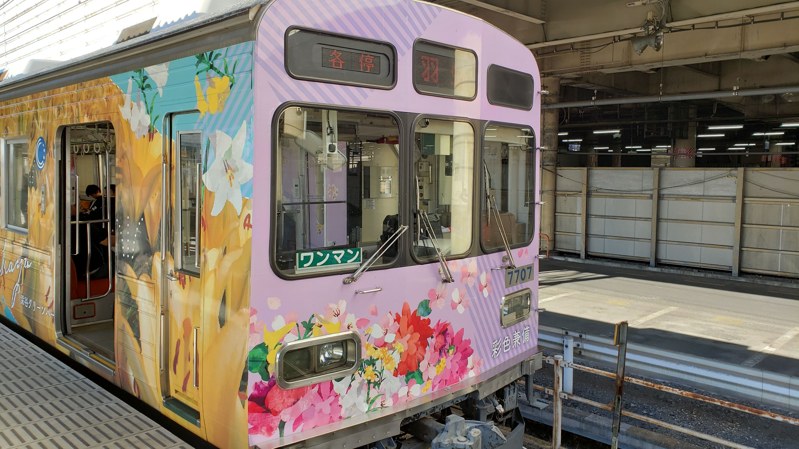
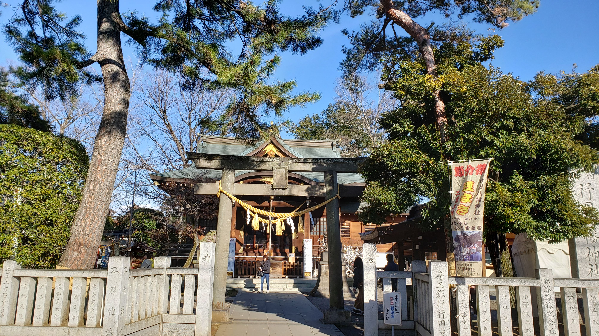
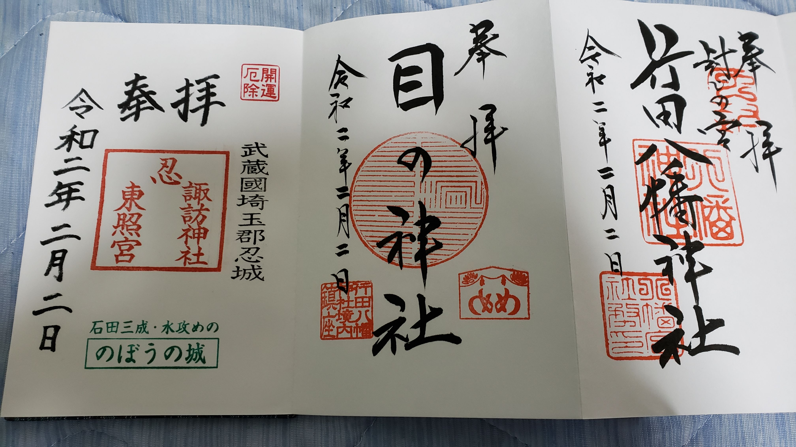

2020年が始まって以来体調が安定しない。

年初、舞台観劇のため埼玉に来ていた母親と神社巡りをした後に若干体調を崩し、仕事には支障はなかったもののその後も体調が安定しない。どうやら自律神経を壊したらしい。

そして1月も後半になると中国大陸方面で発生した新型コロナウイルスの話題で持ちきりになっている。

改めて健康祈願に行った方がよいかと考え、1月25日に[鳩ヶ谷氷川神社](http://www.hikawajinja.jp/)を参詣。

健康祈願のお守り（鳩鈴）をいただいてきた。

ついで2月2日、今度は高崎線熊谷駅から秩父鉄道に。

才色兼備のラッピング車。最近走り始めたのだという。

秩父鉄道に乗るのは初めてだった。現代の関東地方にあって現金のみの鉄道会社は珍しい。

そして行田市駅に向かい、[行田八幡神社](https://www.gyodahachiman.jp/)参詣。

ハンカチで撫で桃をなでる。病魔退散の御利益があるとされる神社、無病息災を願いながら。

さらに当日は日曜日なので、日曜日しか御朱印の書き入れがないという忍東照宮にも足を運ぶ。

そう、その日は「令和2年2月2日」。この数字の並びは当分ないだろう。

さて、この2月2日の行田行きの前も若干疲れやら平衡感覚の怪しさがあったのだが、行ってみると吹き飛んだ。
実は、身体を動かすことが重要、というだけの話なのかも知れない。