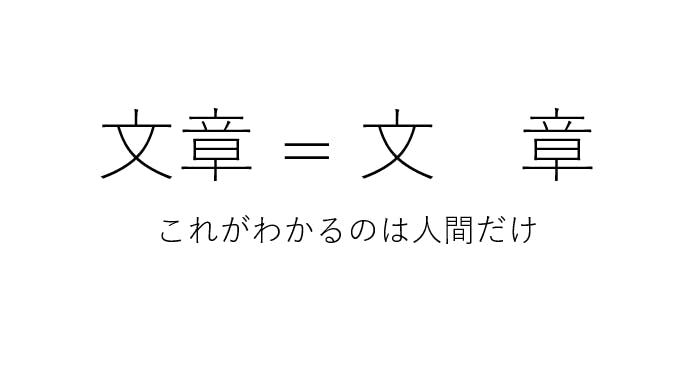

新型コロナウイルスの流行で求められる、人と人との間隔を空けること、social distancing。

その啓蒙のためとして、このところ Twitter などの SNS で、アカウントの表示名の文字と文字の間にスペースを空ける例が増えている。

今朝ニュースサイトを見ると、それを疑問視する声があった[^1][^2]。個人的にはこれは真っ当な指摘だと思う。

スペースを空けてしまうことによって、翻訳、音声読み上げ、検索などの機械による介入を阻害する。これによって、SNSサイトなどの検索機能の利用や、日本語を読めない外国人や、目が不自由であり音声読み上げのソフトを使っている人に対するアクセシビリティを阻害することにつながる。この意見に、私は全面的に賛同する。

## 目で見られればそれでよいなら、それは紙と同じ

機械による介入を許さないとは、すなわち「人間が目で見えればよい」と言っているに等しい。それはすなわち、「紙に書いてある」ことと何ら変わらないということだ。

そして紙に書いてあることと変わらないというのはデジタルデータの利便性を損なう行為である。確かに紙という物体を取り扱う必要がない点では、資源保全や即時伝達という点で確かに利便性はあるのだが、デジタルデータ特有の検索性や分析・加工のしやすさといった利便性を全否定する行為である。その行為は、「我々はソーシャルディスタンスに対する意識を持っている」と主張するためだけに、その利便性と天秤にかけてよいものなのか、という疑問は、あってしかるべきものだ。

また、目で見ることのできる人の立場を優先して、情報の二次利用や弱者に対する配慮という観点のないような表現は他にも見受けられる。例えば、「障害者」という単語の表記について。「害」の字を嫌って「障がい者」という表現を使うことがあるが、これまた「障がい」という表記と「障害」という表記が同一のものと認識できないケースがあり、障害者福祉関係の企業がスクリーンリーダーに配慮して「障害」という表記を使用していることをわざわざ説明しなければならないケースが発生している[^3]。

あるいは、役所などに多く見られる、統計データなどをPDF（CSV等ではなく）で公開するといったことや、いわゆる「神Excel」「Excel方眼紙」といったもの（すなわちデータ化ではなく紙にしたときの見た目を整える目的でスプレッドシートを利用する行為）も、この延長線上にあるだろう。「紙にして出す」という価値観から抜け出せず、そのデータの二次利用などには全く配慮しない。

## デジタル化のために改めなければならない価値観

新型コロナウイルスの流行により出勤者の削減が求められる中、物理的に紙として存在する書類や、印鑑を取り扱うために出勤をしなければならないという人が少なからずおり、それが紙を主体とする文化の見直しに繋がっている。

しかし、本当の意味での紙文化とは、このように「文字として書かれているものを読む」という行為に依存した文化だと思う。紙文化を脱却し、本当の意味でデジタル化が達成された社会では、「日本語の文章を直接読む」こと以外の情報の活用方法が可能になっているはずである。

そうすることによって補助ツールの利用に対するハードルが下がれば、外国人や障害のある人の情報アクセスがしやすくなり、多様性を支えることにもなるはずだ。

[^1]: [生活と意見: ソーシャルディスタンスなどと称してユーザー名や文章にスペースを挟む行為についての苦情](https://gist.github.com/mala/08fdbc680d84bb1b2305688282f26cea)
[^2]: [社名にスペースを挟み「ソーシャルディスタンス」アピール→検索不可になる例が続出中？ （やじうまWatch 2020年5月11日）](https://internet.watch.impress.co.jp/docs/yajiuma/1251552.html)
[^3]: [障害者の表記について（株式会社LITALICO）](https://litalico.co.jp/aboutsite/)