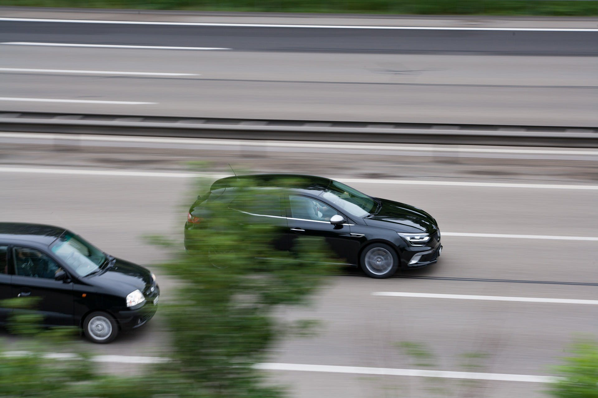

昨日8月21日、自身としては3回目となる運転免許の更新をした。5年前に2回目の免許更新をしてから、準中型免許の制度創設があったり [^1] 、元号が変わった影響で有効期限が西暦併記になったり [^2]、自分自身が埼玉県に引っ越したりといろいろなことがあった。

埼玉県民の免許更新といえば鴻巣市にある運転免許センターである [^3]。よく埼玉県民には不便だと言われる立地であるが、それ以前の場所はさいたま市西区二ツ宮所在の「埼玉県警察機動センター」のある場所だったとされ、それよりは利便性が高いことは明らかだろう。

また、前回運転免許を更新した福島県警察の郡山運転免許センター [^4] も郡山の市街地からは離れた場所であり、会津からは相当な距離である。もっとも会津の山間部の場合、**免許センターに行かずに所轄警察署で更新するにしても片道50km**という地域があるのだが…。
（※会津坂下警察署管内の金山町・昭和村や、南会津警察署管内の只見町・檜枝岐村などが該当する。）

さて、本日、テレビ朝日系「列島警察捜査網 THE追跡」 [^5] で、高速道路の追越車線を低速走行した車が通行帯違反により検挙された件が放送され反響を呼んでいる。検挙された女性は右側車線を延々と走ってはいけないということを知らなかったとしており、交通法規に関する知識の欠落に関しては擁護できないだろう。

しかしながら、これに対する反応を見ると、スポーツカーやオートバイなどを好きで運転している層からの、通行帯違反を厳しく取り締まるべし、あるいは、今回の通行帯違反に対する取り締まりを支持できないのであれば免許返納すべしという意見が散見される。そのような意見の背景に「自分が飛ばしたいから」という邪な考えはないだろうか。

先日の免許更新の際の講義で印象に残っているのが、**歩行者や自転車は交通ルールを知らない可能性があることを考えて十分注意すべき**との話であった。埼玉県は自転車の交通事故が非常に多く、警察や交通安全協会としても啓発に努めてはいるものの交通ルールが浸透しているとは言いがたい状況であることからの話ではあるのだが、実際様々なバックグラウンドの人が等しくアクセスできるのが道路というものである。高速道路でさえ、自転車や原動機付き自転車に乗った配達員が走っているかもしれない [^6]。

では運転免許を持っている人の場合。これも最低限のレベルは保証されるものであって欲しいが、やはり免許を持った運転手といえどレベルの差というのは存在する。そもそも道路状況は地域差が激しく、その地域の道路状況によって身につけられる知識や技能は大幅に違うのではないか。例えば（私のように）山間部での運転経験がある人はカーブや勾配の多い道には慣れているかも知れないが、多車線の道路が少ないため追い越し時などの動作がぎこちないかも知れない。温暖地で過ごした人は積雪・凍結路面での運転操作を誤るかも知れない。東京の一般道を走り慣れている人は、都内は路上駐車が非常に多いので右側車線を走ろうとするかも知れない。どんな場面にも対応できるドライバーはごく少数なのではないだろうか。

つまり、交通ルールを知らない可能性のある歩行者や自転車であったり、運転技術や交通ルールへの理解度、車両特性などが自分と異なる可能性のある他のドライバーの存在に鑑みれば、やはりドライバーとしての心得の要諦は「かもしれない運転」であろう。その場その場に応じてどのような危険があるかを頭に置いた運転を行うこと。そして自分が最善手だと思っていることを他人がそう認識していない可能性や、認識していてもできない何らかの事情がある可能性を考え、それを尊重すること。**仮にそれが交通違反に該当する内容であっても、交通違反かどうかを判断するのは警察などの法執行機関ないし司法であるべきで、それを理由に、不安全行為を注意したり周囲に危険を知らせたりするための範囲を超えて、煽り運転や威迫するような行為に及ぶことは「私刑」である。**

カバー画像: [Christine Sponchia](https://pixabay.com/ja/users/Sponchia-443272/?utm_source=link-attribution&utm_medium=referral&utm_campaign=image&utm_content=3396909)による[Pixabay](https://pixabay.com/ja/?utm_source=link-attribution&utm_medium=referral&utm_campaign=image&utm_content=3396909)からの画像

[^1]:[平成29年3月12日施行改正道路交通法（警察庁）](https://www.npa.go.jp/koutsuu/menkyo/kaisei_doukouhou/leaflet_B.pdf)
[^2]:[西暦と元号の併記になった運転免許証が交付開始！新元号表記の開始日についても紹介 （グーマガジン 2020年3月16日）](https://www.goo-net.com/magazine/110824.html)
[^3]:[運転免許センターへのアクセス（埼玉県警察）](http://www.police.pref.saitama.lg.jp/f0110/menkyo/menkyo.html)
[^4]:[免許センターへのアクセス（福島県警察）](http://www.police.pref.fukushima.jp/04.menkyo/-8other/menkyoaccess/m_9.html)
[^5]:[列島警察捜査網 THE追跡（テレビ朝日）](https://www.tv-asahi.co.jp/the-tsuiseki/)
[^6]:[自転車のウーバー配達員「時間短縮のために首都高走った」（読売新聞 2020年5月16日）](https://www.yomiuri.co.jp/national/20200516-OYT1T50183/)
