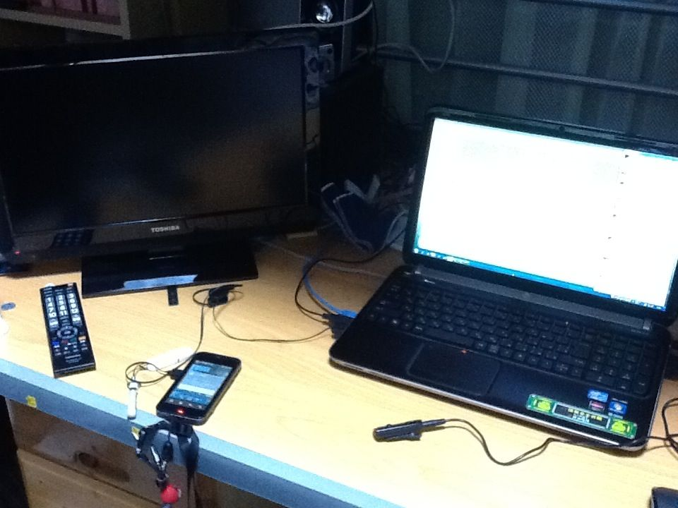
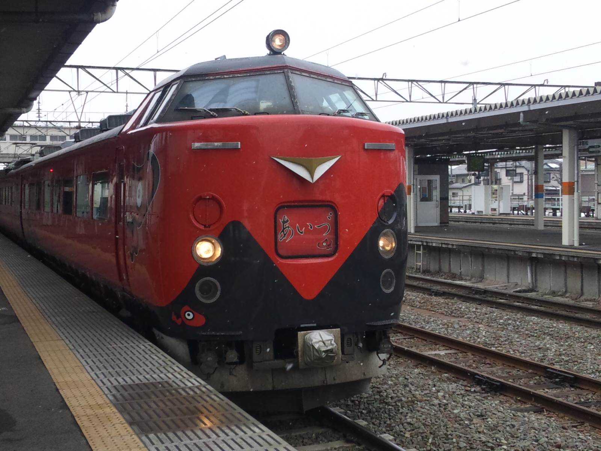

今週末、2年間使ったGalaxy S9から、新しい端末 Galaxy S20+ への機種変更を行うことを決めた。今後手続きを進める予定である。

高校進学直前に au 回線を契約して以来、購入した携帯電話としては12台目になる。この記事は、それぞれの思い出を記す記事である。

- 1号機 A1402S II
- 2号機 W41S
- 3号機 W61S (Cyber-shotケータイ)
- 4号機 IS03
- 5号機 ISW13HT (HTC J)
- 6号機 HTL22 (HTC J One)
- 7号機 SOL24 (Xperia Z Ultra)
- 8号機 iPhone 6
- 9号機 HTV31 (HTC J butterfly 第3世代)
- 10号機 SOV35 (Xperia XZs)
- 11号機 SCV38 (Galaxy S9)
- 12号機 SCG02 (Galaxy S20+)

### A1402S II
[機種詳細 （auケータイ図鑑）](https://time-space.kddi.com/ketaizukan/2004/8.html)

最初に手に入れた携帯電話はソニー・エリクソン製のミドルレンジ機。カラー選択はホワイト。当時auには「ガク割」という学生割引サービスがあったが、適用条件が「CDMA 1X」（型番が「A」で始まるパケット定額制非適用機）であることが条件だった一方、当時父親がソニー製端末を使用していたことでこの選択となった。

しかし上下矢印キーがダイヤルになっており、これが若干癖があった。「不意に触ったことで、高校の授業開始前に仕掛けていた携帯電話のオフタイマーが不発に終わり、授業中に携帯電話の着信音が鳴ってしまい没収の憂き目に遭った」という出来事が起きたこともある。

### W41S
[機種詳細（auケータイ図鑑）](https://time-space.kddi.com/ketaizukan/2006/33.html)

2年経つか経たないかで初の機種変更をかけた。カラー選択はブルー。au LISTEN MOBILE SERVICE (LISMO) 対応になり音楽プレイヤーとしての機能を手に入れた機種である。この機種はかなり満足度が高かった記憶がある。

### W61S （Cyber-shotケータイ）
[機種詳細（auケータイ図鑑）](https://time-space.kddi.com/ketaizukan/2008/25.html)

大学生になって次の機種変更。カラー選択はブラック。カメラブランドの名を冠し光学ズームにも対応した携帯電話で、現在人気を博す「Xperia 1 II」の祖先とも言える。反面、当時の共通プラットフォーム「KCP+」の影響でレスポンスが若干鈍かった。

###IS03
[機種詳細（auケータイ図鑑）](https://time-space.kddi.com/ketaizukan/2010/3.html)

（写真: 2012年3月26日撮影。机上に置いてあるスマートフォンがIS03。ノートPCは、翌月からの東京長期出張に備えて調達したHP製ノートPC。）

一般的なスレートスタイルのものとしてはau初のスマートフォン。Android 2.1（アップデートで2.2）。カラー選択はブラック。購入当時自分はアルバイトでスマートフォンアプリの開発会社におり、実機テストや大学の卒業研究にも投入した。パフォーマンス比較に使ったため論文のグラフにもこの機種の機種名が残っている。

東日本大震災発生時は、会津若松駅で母親を見送った後に一瞬バッテリー残量がゼロになり電源が切れたが、しばらくして再起動に成功。その後自宅に到着する直前に緊急地震速報を拾うこととなった。自宅は固定回線・携帯電話回線ともその後3日ほど不通になったため情報収集の役に立つことはなかったが…。

（写真: 東日本大震災直前に見送った「快速あいづライナー4号」。IS03で撮影。2015年3月ダイヤ改正まで磐越西線では485系を用いた指定席連結列車が運転されていたが、会津地域のマスコットキャラクター「あかべぇ」が描かれた写真の塗装で運転されたのはこの日が最後になった。）

### ISW13HT (HTC J)
[機種詳細（auケータイ図鑑）](https://time-space.kddi.com/ketaizukan/2012/18.html)

UQ WiMAX接続機能を備えた3Gスマートフォン。Android 4.0。カラー選択はブラック。結局防水を名乗るには至らなかったが防水機能の獲得を目指した頑丈な設計が特徴だったが、そのためにSDカードの抜き差しは筐体の開け閉めに苦労するものとなった。

beats製イヤホンが付属し、beatsによるサウンドチューニングがされた音楽再生を重視した機種でもあった。満足度は高かったが、バッテリーを酷使したためか1年で役目を終えることとなった。

### HTL22 (HTC J One)
[機種詳細（auケータイ図鑑）](https://time-space.kddi.com/ketaizukan/2013/11.html)

4G LTE対応スマートフォン。Android 4.1（アップデートで4.2→4.4）。カラー選択はシルバー。一見グローバル仕様に見えるが密かにおサイフケータイを備えている。こちらもbeatsによるチューニングがされており、かつ本体正面にステレオスピーカーを備えている。このため他の機種と比べると着信音も多少大きく聞こえるものだった。機能面やソフトウェア面では満足していたが、反面本体のUSB端子付近の加工が甘く見えるなど、「持ち歩くもの」としては若干不安があったことは確かである。

### SOL24 (Xperia Z Ultra)
[機種詳細（auケータイ図鑑）](https://time-space.kddi.com/ketaizukan/2014/16.html)

当時としては巨大な6.4インチ画面を備えたスマートフォン。auからは通話機能を持った携帯電話として販売されていたが、ソニーからはWi-Fiタブレットとしても発売された。Android 4.2（アップデートで4.4）。カラー選択はパープル。このような巨大端末であるがおサイフケータイに対応している。防水機能も備え、動画などの閲覧端末としては申し分なかったが、当然ながら現代のようにベゼルレス技術もない中で6インチ級画面を備えた巨大端末であり取り回しの悪さがネックとなった。しかし機体に特に不具合はなかったため、後述するiPhone契約後も、mineo回線を追加契約して、FeliCa決済などのサブ回線として運用された。

### iPhone 6
自身最初で最後のiPhoneである。カラー選択はシルバー。当時スマートフォンアプリの開発に携わっており、iPhoneの取り扱いやユーザーインターフェイスも研究する必要性からiPhoneを所有してみることにしたという背景があるが、おサイフケータイの受け皿が必要なためXperia Z Ultraと併用することが事実上条件であった。さすがにApple端末ということもあり特に不具合は起こさなかったが、他の家族はAndroid端末を所持していることから運用を統一する必要性が出て、Android端末に戻すこととなった。

### HTV31 (HTC J butterfly 第3世代)
[機種詳細（auケータイ図鑑）](https://time-space.kddi.com/ketaizukan/2015/9.html)

Androidに戻ってきたところでそれまでで満足度の最も高かったHTCを選択。Android 5.0（アップデートで6.0）。カラー選択はネイビー。ハイレゾ音源対応、フロントスピーカーに加えデュアルカメラと構成的にはハイエンド端末。しかしあまり放熱がよくないプラスチック筐体も相まって発熱問題に悩まされ、パフォーマンスが落ちることも少なくなかった。しかし転職を挟んだこともあり2年間現役を張っていた。

### SOV35 (Xperia XZs)
[機種詳細（auケータイ図鑑）](https://time-space.kddi.com/ketaizukan/2017/11.html)

後釜として悩んだ末にXperiaを選択。Android 7.0（アップデートで8.0）。カラー選択はブルー。アルミボディが美しい端末で動作もスムーズになったのは嬉しかったが、個人的にはバッテリーの持ちがいまいちな感想だった。特にAndroid 8.0化からバッテリー消耗が顕著になり、アップグレードプログラムの繰り上げオプションを行使することになる。

### SCV38 (Galaxy S9)
[機種詳細（auケータイ図鑑）](https://time-space.kddi.com/ketaizukan/2018/9.html)

最初期からサムスン製端末を使っていた妹の影響もあり、初のGalaxy選択。Android 8.0（アップデートで最終的に10）。カラー選択はブラック。多様な生体認証、2年近く経っても維持されるパフォーマンス・安定性・バッテリーなどはこれまでの11台の中で最も優れていると考えており、今後の機種選定の一つの基準となったともいえる。

ちなみに、サムスン製端末は初期設定で戻るキーが右側にあることで知られている。他のAndroid端末に合わせて左に変える人も多いかと思うが、私はAndroid 2.x端末の使用経験があるため右側に設定している。左側になったのはAndroid 4.x（タブレットは3.x）以降だが、サムスンはその後も右側を原則としているようだ。

### SCG02 (Galaxy S20+)
次の機種としては Galaxy S20+ を選定し、今後手続きを進める予定である。

選定の背景としては、

- Galaxy S9の運用実績からサムスン製端末は長期にわたって安定稼働が見込まれること
- 防水ケース付きで浴室で動画プレイヤーとしても使っているiPad miniが動画再生中に通信不安定になるケースが発生しており運用を統合する必要があること
- 上記のため大型端末を容認することにしたが、おサイフケータイの受け皿が必要なためGalaxy S20 Ultraは容認できないこと
- 廉価端末である Galaxy A41 は早期に陳腐化するリスクや、ワイヤレス給電機能がないといった機能面での不安があること（※以前、Galaxy Watch Active用充電器の置き忘れにより救援を求めたことがあるなどからワイヤレス給電機能は必要と判断している）

という点から決定した。

コロナ禍で激動する世の中ではあるが、どう社会が変わろうと今後スマートフォンの重要性は更に増すことは疑いない。その中にあって、憂いなきものを選んだつもりである。
