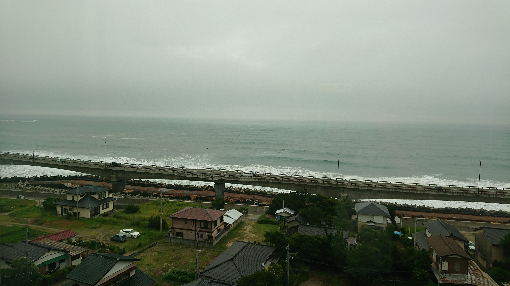

2021年3月。東日本大震災から10年が経ちました。

### 改めて記す当時の記録

私は当時、福島県会津若松市の実家から通学する大学生でした。その日は大学の授業は3月なのでなく、アルバイト先も休みを取っており、
午前中はバスでアピタ会津若松店[^1]に買い物に行き、そこから会津若松駅に向かいました。

14時14分、横浜に向かう予定だった母親を乗せた快速列車「あいづライナー4号」が郡山に向けて出発。
そこから帰路につこうとしたとき、当時使っていたスマートフォン・IS03のバッテリーが突如ゼロ表示になり電源が切れました。
おかしいと思い電源を入れ直したら電源は入り、バッテリー残量も特に異常なし。外に出ると強い吹雪になっていました。

実家は駅から徒歩20分程度の距離にあり、14時45分頃に自宅に到着すると同時にIS03が警報音を立てます。
画面を見ると「宮城県沖での地震」との一報。同時に強い揺れに襲われました。
会津若松市は大きな地震が非常に少ない地域です。2021年3月現在、これが**会津若松においては、近代観測史上初、かつ現時点で唯一の震度5以上の地震**でした。

家の中はひとまず物が崩れているなど以外は特に問題はありませんでした。停電も断水もありませんでした。
自室では当時設置していたサーバー機が地震の揺れでずれ、接続されていたテーブルタップのスイッチに接触してしまい電源が切れていました。それの復旧作業を行っていると、30分ほどして**固定回線・スマートフォンともインターネットが不通**となったことに気づきます。KDDIの設備が被災したことによるものであり、以後スマートフォンは2日、固定回線は3日、不通が続きました。当時通っていた大学にも行ってみましたが、宮城県内の上位回線設備が被災したとのことでインターネットには接続できず、結果的にアルバイト先の同僚宅から安否報告をしたのを覚えています。

列車で旅立った母親は、猪苗代町で列車が緊急停止し、代行バスで引き返してその日のうちに帰宅。父親は当時、単身赴任として平日はさいたま市浦和区に住み、栃木県内で電力系統運用の仕事をしていたため、通常は毎週末に帰宅していましたが、交通機関の途絶も相まって数週間戻ってくることはありませんでした。

翌日以降、インターネットは不通であったものの、会津では生活の大きな支障はありませんでした。翌々日の3月13日には近くのスーパーが、物流混乱のさなかにもかかわらず通常通り7倍ポイントセールを敢行し、買い物客が密になっていたことを覚えています。
しかし、それ以降は燃料不足によってガソリンスタンドに長蛇の列ができたり、業務用車両の燃料にも事欠いたことでゴミ収集の制限や列車の大幅な運休などが発生。一方で3月26日に磐越西線が運転を再開すると、不通の東北本線に代わり石油貨物列車が走り、そこからは徐々に燃料の需給も改善していきました。

ガソリンスタンド前の道路で給油を待つ車両（会津若松市昭和町の馬場町通りにて2011年3月24日撮影）

JR磐越西線・只見線の運転見合わせは継続していたが、3月12日午後に線内での運転を再開していた会津鉄道線への直通列車に限って3月23日に営業を再開した会津若松駅。東北本線・東北新幹線の不通が続く中、福島県と関東を結ぶ重要な交通手段となっていた。只見線の会津坂下-小出間は大雪の影響で震災前から運休しており、4月12日に復旧したが、7月29日の新潟・福島豪雨により一部区間長期不通となった。

店内が被災し地平の商品搬入口付近で生活物資の販売をしていたケーズデンキ会津若松本店（2011年3月25日撮影）

磐越西線を走り、会津若松駅で方向転換する石油貨物列車（2011年4月5日撮影）

[^1]: 現 MEGAドン・キホーテUNY会津若松店

### 震災の残した教訓
それは、「目的を達成できる手段は多数用意しておけ」ということだと私は考えています。

東日本大震災では、沿岸部の発電所・石油コンビナートの被災によって電力も石油も不足、そこに地震や津波による物流網の破壊が重なって生活物資が不足する構図が起きました。
停電の時電気自動車に蓄電していればしばらくしのげるとは言っても、このような状況が起きればやがて限界は来ます。

安否確認や情報収集にインターネットが有効といっても、回線設備の被災で3日間インターネットから隔絶された私はその意見を是認できません。公衆電話を無闇に減らすべきではないですし、マスコミによる災害報道の意義も大きいところがあります。NHKは法令[^2]により、災害報道を最優先に行うことが義務づけられている機関であり、その設備や職員の質の維持のためにも受信料を支払うことに私は異議はありません。

再生可能エネルギー（自然エネルギー）は天候によって発電効率が大きく変わります。地熱発電所も時間経過による出力の減衰が問題になり商業ベースに乗りません。水力発電所もダムによる自然破壊の問題が論じられて久しいほか、東日本大震災と同じ2011年に会津地方を襲った新潟・福島豪雨では、水力発電用ダムの管理状況によって水害を拡大させたのではないかと地元住民に訴訟を起こされる事案も発生しました。火力発電所も、天然ガスの輸入が滞ったことにより今年1月の電力市場取引相場の暴騰を招きました。
このように、原発はもちろんのこと、全ての発電設備に一定のリスクがあるわけです。リスクをゼロにするのではなく、リスクと折り合いをつけるにはどうするかというのが重要なのではないかと考えます。

震災や現下のコロナ禍のときにも見られましたが、陰謀論を信じる人が後を絶たないと言われ、その原因として、文筆家の古谷経衡氏は以下のように論じています[^3]。

> しかし、現代において「長考」「熟考」は排斥される傾向がある。

> ある物事を長く観察し、長く考慮したならば、そこには懐疑や批判が生まれる。この喪失がデマをますます亢進させるのである。知性とは懐疑から始まる。懐疑こそ、人類の「バカ」化を押しとどめる唯一の処方箋でははないだろうか。

懐疑・批判というよりは、「それは何故起きているのか」に真剣に向き合う必要があるのではないかと私は考えます。それも「何者かの悪意」などの人的要因に帰結させるのではなく[^4]。

カバー写真：茨城県日立市・常磐線日立駅付近。2017年7月29日撮影。

[^2]: [気象業務法](https://elaws.e-gov.go.jp/document?lawid=327AC0000000165)第15条第6項
[^3]: [｢人類はどんどんバカになっている｣陰謀論を信じる人が後を絶たない根本原因](https://president.jp/articles/-/43986)
[^4]: [ハンロンの剃刀](https://ja.wikipedia.org/wiki/%E3%83%8F%E3%83%B3%E3%83%AD%E3%83%B3%E3%81%AE%E5%89%83%E5%88%80)
