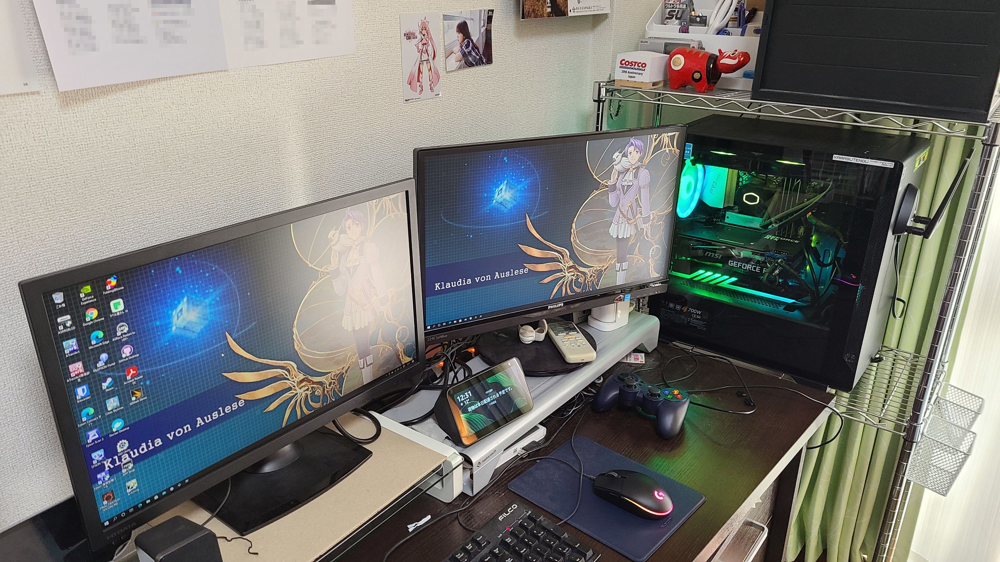
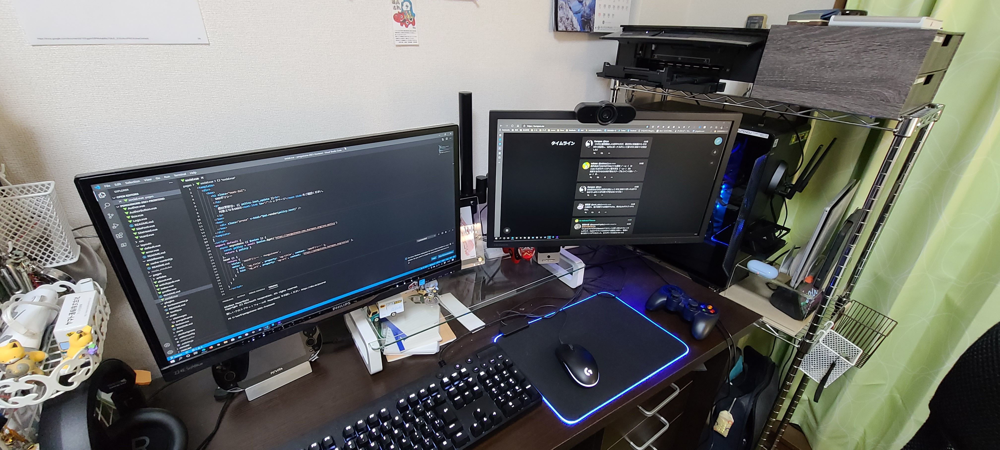

昨年11月頃から取り組んでいたPCデスクまわりの整備が完了しました。

### PC自作に至る経緯

そもそも、一昨年11月にゲーミングノートPC（Acer Predator PH315-51-A76H）を買ったのですが、熱処理が上手く行かずコマ落ちする場面が見られたため、それ以前から使っていたゲーミングデスクトップ（マウスコンピューター G-Tune NEXTGEAR NG-i620SA10）[^1]を続投させていました。
しかしそれも基板系が7年前のものであり老朽化が否めず、10年ぶりにPCの自作を行うこととしました。

10年前に自作したPCは、省電力の自宅ファイルサーバーの構築を目的とし、Intel Atom D510 CPUをオンボード搭載した Intel D510MO を核とする構成として、NEC VALUESTAR U VU47L/25B の筐体を再利用して製作したものでした。したがって、マザーボードの取り付けを伴う自作は初めてとなります。

性能基準としては主にプレイするゲーム（ファイナルファンタジーXIV, Cities:Skylines）をターゲットとすることとし、動画・映像製作を行わないことからメニーコアCPUはひとまず選択肢から除外することにしました[^2]。CPUに関して世間の関心はAMD Ryzenに完全に移っていましたが、このPCの建造の検討をし始めた時期には Ryzen 3 3300X の品薄が深刻化しており、連日予算の検討を行いながらニュースもチェックしていると Core i3-10100F の発売のニュースが飛び込み、これを軸に設計を行うことを決めました。

最終的に、マザーボードとして ASRock B460M Pro4 と組み合わせることで決着し、グラフィックボードは各社の新商品の発売が間近であることに加え、ボーナス支給まで様子見とし、ひとまず旧PCから GeForce GTX 970 を転用することにしました。

PCケースも、10月下旬に Thermaltake S100 TG の発売の報に接して採用を決定。元々設置場所の高さ制限と、近年のPCケースの大型化傾向のため、MicroATX以下のケースとしなければならなかったことと、正面に何もないことがポイントで、ケースの前のスペースを有効活用できそうなのがポイントになりました。

そして11月3日に全てのパーツが到着し、一次構成の組み立てを実施。
その後新マシンでFolding@homeに参加し、発熱や騒音の状況を見て追加対策を講じ、グラフィックボードはGeForce RTX 3060 Ti発売後ボーナスが支給されたタイミングで発注して最終的な構成[^3]となりました。

### レイアウト最適化
2021年に入り、自宅全体のレイアウトを最適化することになりました。
現在の自宅に移って4年が過ぎました。最初の1年は妹と同居していたため、同居前提のレイアウトになっていた部分があり、例えばプリンタがPCを設置している寝室ではなくダイニングスペースにあるなどしていました。これで食事の際に印刷後の排紙トレイに接触するなどの不都合が生じていました。
年に数回家族が来る以外は長らく一人で生活しているため、これを機にレイアウトの見直しに踏み切り、その手始めとして寝室のPC周辺へのプリンタの移動を行いました。

また、マルチディスプレイを構築するためにモニター台を机上に並べていましたが、これもスペースを有効活用できていない感があるためディスプレイアームを導入。元のモニター台は一つ再利用し、コレクション台として利用する方針で、手始めに実家からティオ・プラトーのねんどろいどぷち[^4]などを持ってきて設置しました。ほかに発注中のもの[^5]があるので今後充実する予定になっています。

[^1]: 構成は、Intel Core i7-3770K, 16GB RAM, 1TB HDD, NVIDIA GeForce GTX 660。2019年に電源ユニット交換と同時に、SSD 1TB（SAMSUNG 860QVO）, NVIDIA GeForce GTX 970に交換していた。
[^2]: それでも Core i7-3770K と比較すると飛躍的な性能向上になるため。Predator PH315のCPUが6C12Tであるため、6C12Tを理想ラインとしつつ、6C6T・4C8Tも許容する方針で選定を行った。
[^3]: [プロフィールページ](/profile)に掲載しています。
[^4]: [英雄伝説 碧の軌跡 完全予約限定版の予約特典](https://www.4gamer.net/games/126/G012619/20110414003/)。エリィ・マクダエルとセットになっているが、そちらは台座が破損したため実家で保管している。
[^5]: 5月下旬到着予定。