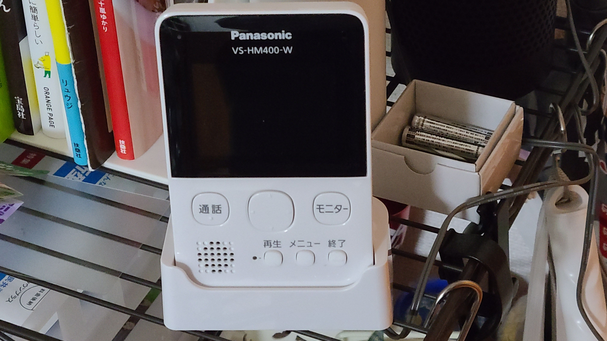

私は現在、さいたま市中央区某所の2LDKの賃貸マンションを4年半ほど借りて住んでいる。現在は一人暮らしであるが、4年半前に転職するにあたって家族の提案で、先に関東で働いていた妹を呼び寄せての二人暮らしをするために借りたもので、それから1年して妹が交際相手との同棲のため引っ越し、3年半ほど一人で生活している。

## 夜闇に現れた「相談員」

4月7日の木曜日、いつものように風呂に入ろうとした矢先、ドアホンが鳴った。

この物件のドアホンにはカメラがなく、宅配業者などの可能性もあるため普通にドアホンを取ったところ、訪問者は不動産の相談員を名乗る男。興味がないと伝えるも相手は引かず、結局渋々相手の「アンケート」に答えることとなってしまったのである。相手は日曜日19時の再訪を約束して帰っていった。

家族に相談したりTwitterなどで情報収集してわかったことだが、おそらくこれは不動産の飛び込み営業であろう。個人名を名乗りはすれど社名は名乗らず、「アンケート」も不動産を買ってくれそうな相手の選別と思われる。

## スクリーニングに潜む罠

訪問者があったとき、それがどのような人物か確認するための方法はいくつかある。

1. カメラで相手の容貌を確認すること
2. インターホンを使って声を確認すること
3. 直接対面して相手の容貌と声を確認すること

今回、物件にはカメラがないため、1. の方法はとれない。3. はドアを開放して物理的に接触するため、訪問者に悪意があればそれを容易に達成できる危険性があるので常識的には用いられない。そのため 2. の方法に頼ることになったわけだが、 2. にしても相手に在宅であることは知られてしまうわけであり、また相当な話術を使うセールスマンであれば丸め込まれる危険性がある。

つまり、 3. が危険であることは想像にたやすく、当然ながら私もそれはわきまえていたが、相手の目的如何によっては 2. も十分リスクがある点を軽視していた。

### 脅威の内実について疑うことすらできない

この記事のタイトル「知らないと知られていないこと」は、2002年当時のアメリカの国防長官ラムズフェルド氏の著名な演説「[知られていると知られていることがある](https://ja.wikipedia.org/wiki/%E7%9F%A5%E3%82%89%E3%82%8C%E3%81%A6%E3%81%84%E3%82%8B%E3%81%A8%E7%9F%A5%E3%82%89%E3%82%8C%E3%81%A6%E3%81%84%E3%82%8B%E3%81%93%E3%81%A8%E3%81%8C%E3%81%82%E3%82%8B)」の一節からとっている。これを解説したWikipediaの記事の中に、哲学者のスラヴォイ・ジジェク氏の言葉として引用されているのが

> ラムズフェルドは、イラク政府と対決するにあたって最大の危険が『知らないと知らないこと』、つまりサダム・フセインの脅威の内実について疑うことすらできないことだと考えていたのかもしれない。

「脅威の内実について疑うことすらできない」。まさにこの言葉が当てはまるシチュエーションである。情報ゼロの状態からは訪問者を疑うことはできない。そこを疑い始めたら、善意の訪問者をも拒絶しなければならないのである。

## ということで…

翌日、ドアに固定するタイプの後付けドアカメラを設置。

カメラで相手の容貌を確認することができるようにした状態で日曜日の19時の訪問に備え、当日は不在を装い難なきを得た。

なんとなくこの後付けカメラの必要性は認識はしていたが、実際にそのような悪意に晒されることが幸か不幸かなかったため、これまで付けずに過ごしていた。ただ、そのような牧歌的な状況がいつまでもそうであるとは限らないわけで、今後転居する際はこういった基本的なセキュリティ装備などは意識して選ばなければと感じたところである。