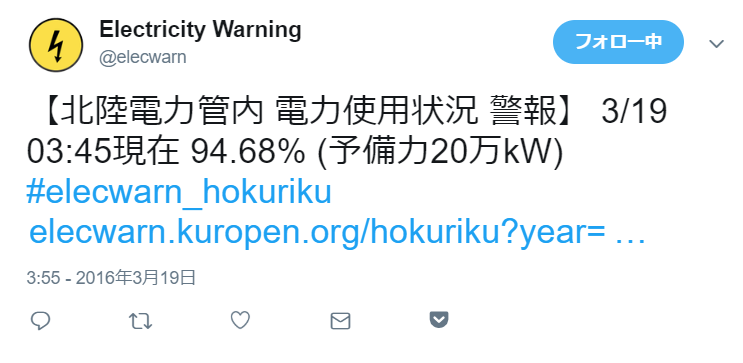
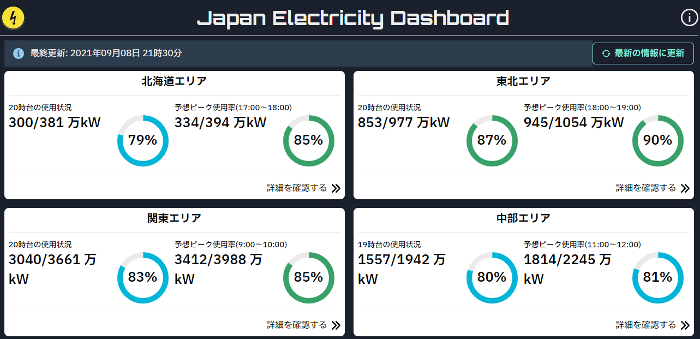

この週末・9月4日から、実質約5年半ぶりに再始動したプロジェクトがあります。

Kuropenは東日本大震災後の2012年から、各地の電力会社からの情報をもとにしてリアルタイムで電力使用量についての情報を発信する「電力使用率警報Bot」を運用していました。

これについては、東京電力の分社化に合わせて2016年3月にサービスを終了しましたが、それから5年が経ち、電力をめぐる情勢は大きな変化を見せています。

脱炭素の潮流の中で日本は諸外国から石炭火力発電の運用について非難される渦中にあり、また震災以来の原子力発電の問題や2021年1月の液化天然ガスの供給支障による電力危機[^1]、
一部の太陽光発電所における自然破壊を伴う開発など課題は山積しています。

[^1]: [LNG不足のなぜ 生産・物流混乱が壁 電力需給逼迫で](https://www.nikkei.com/article/DGXZQODZ129VO0S1A110C2000000/) (2021年1月13日 日経産業新聞)

しかし、どんなに時代が変わっても、一つ変わることがない真理は、ないものは使えないということです。

発電や電力消費の動向を「見る」ことによって生活パターンを工夫することが、課題を乗り越える助けになる。その思いから、5年半ぶりにサービス運用を行うことにしました。

新サービスは、日本の電力消費の動向を見る場所という意味合いで、[Japan Electricity Dashboard](https://jed.kuropen.org/)という名前で運用します。

## 運用方針について
まず、TwitterやMastodon等ActivityPubのbotとしての運用は、少なくとも当面の間は行いません。

API対応への労力があるのと、現在各電力会社[^2]は1時間ごとの使用量に加えて供給力も公表している一方、
短期の供給力は再生可能エネルギー由来のもの[^3]を除いて公表していないため、短期の使用率を計算することは不可能もしくはふさわしくないと判断しています。

[^2]: 電気事業法改正により発送電が分離されたため、ここでの「電力会社」とは一般送配電事業者（東京電力パワーグリッドなど、各地域の送電網を管理している会社）を指します。
[^3]: 太陽光発電（東北電力ネットワーク管内ではそれに加えて風力発電）

そうすると速報性はなくなるため、SNS botとしての運用は不可能と判断し、5年前以前はTwitter botの補助として運営していた「アーカイブサイト」形態とすることにしました。

## プロジェクトの意義
では各電力会社もWebサイトで使用率を公表している中、データを収集してまとめサイト形態にすることに何の意味があるかというと、全国の状況を1か所で表せるということです。
東日本大震災以来、各会社に閉じた体制が疑問視される中で、最近は地方をまたいだ電力融通が増えており、全国の状況を把握することには意義があると思います。

また、もちろん広域運用機関など取りまとめを行っている組織はありますが、より見やすい形を追求することが、現状を理解する一助になるものと考えています。

## 権利表記
elecwarn projectのアイコンは[Hareta](https://twitter.com/haretter)氏の著作物であり、
利用条件は[クリエイティブ・コモンズ 表示 - 非営利 - 継承 3.0 ライセンス](https://creativecommons.org/licenses/by-nc-sa/3.0/deed.ja)となります。
