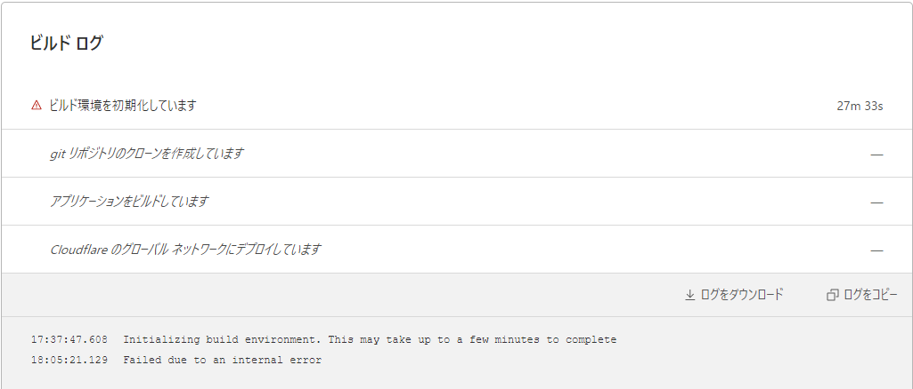

**2021年12月26日追記** この後安全が確認されたため、このサイトのみCloudflare Pagesに戻してあります。他2サイトは、Next.jsに移行したためVercelに置いてあります。

なお、以下に触れている「一部画像が表示されなくなるトラブル」は、**当該画像の拡張子が大文字であった**ことにより発生したものであり、
それまでの環境でうまくビルドできていたかも正確に検証されたものではありません。お詫びして訂正致します。

※以下、原記事2021年9月22日公開

********

このサイトをはじめ、自分が公開しているサイトにはいくつか[静的サイトジェネレーター](https://fastcoding.jp/blog/all/info/ssg/)を使うものがある。

2021年7月にDNSサーバーをCloudflareに切り替えて以来、これらのサイトでCloudflare Pagesを使っていたが、最近若干ビルドの遅さを感じるようになっていた。

先日9月20日のこと。[Japan Electricity Dashboard](/posts/20210908_japan-electricity-dashboard)への修正をかけたものをCloudflare Pagesにデプロイしようとしたところ、
あろうことか30分近くビルド開始まで待ったうえで内部エラーで失敗している。

これが一時的な事象なのかはわからない。障害情報として公表されている形跡もない。
ただ念のため、Cloudflare Pagesを使っているプロジェクトは順次移管することにした。

- Japan Electricity Dashboard: Next.jsを使っているのでVercelへ
- このサイト: Gatsby Cloudへ（当初Vercelにデプロイしたが、一部画像ファイルが表示されなくなるという別のトラブルを引き起こしたため）
- [akabe.co](https://akabe.co/): リニューアル予定なのでリニューアル後にVercelへ
