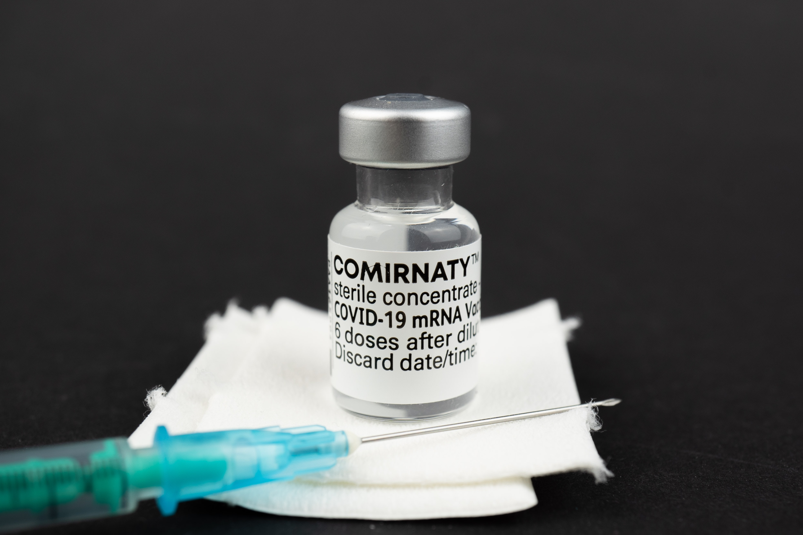
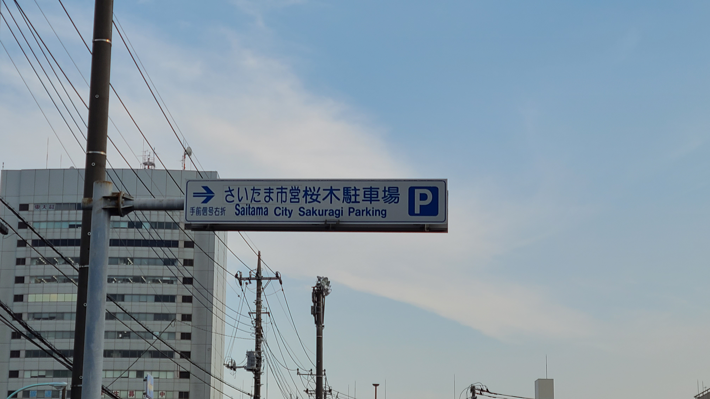
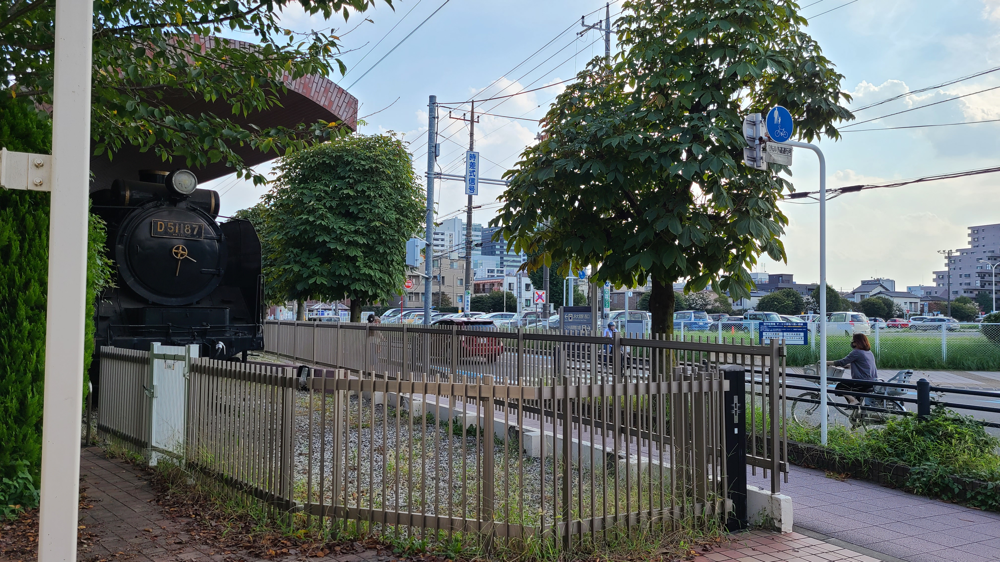

**免責事項:** この記事に記載する内容は個人の感想であり、医療・医薬品に関する正確な情報を提供することを企図したものではありません。
なお、ワクチンに関する情報は[厚生労働省](https://www.mhlw.go.jp/stf/seisakunitsuite/bunya/vaccine_00184.html)ならびにお住まいの自治体のWebサイト等でご確認ください。

**********

<small>Photo by <a href="https://unsplash.com/@mbaumi?utm_source=unsplash&utm_medium=referral&utm_content=creditCopyText">Mika Baumeister</a> on <a href="https://unsplash.com/s/photos/vaccine?utm_source=unsplash&utm_medium=referral&utm_content=creditCopyText">Unsplash</a></small>

昨日9月23日に、新型コロナウイルスに対するワクチンの1回目接種を行ってきました。

さいたま市では9月3日に30代以下の一般接種が解禁されました。
その後しばらく予約が取れない状態が続いていましたが、9月10日に空いている枠を見つけ、各方面の予定を調整したうえで予約にこぎつけました。

自分が予約した会場は[さいたま市営桜木駐車場](https://www.city.saitama.jp/002/001/008/006/013/008/p083853.html#t-sc)でした。
ここはさいたま市内のほかの会場とは **予約システムが別** になっていて、空いている枠を探す際には2つのシステムを行き来しなければならないのはなんとかならなかったのかという感もあります。

大宮駅から会場までは徒歩で10分弱。シャトルバスもありますが、同地近くを車で通過することも多い自分は渋滞しやすいことを知っているので、バスは避けました。
逆に早く到着しすぎ、近くにあるJR大宮総合車両センターのベンチで時間調整をしたりしていましたが…。

到着後、受付もつつがなく終了し、接種実施。注射を受けた時の痛みはほぼなく、その前の7月に健康診断で受けた採血のほうがよほどきつかったです。

注射後から左肩の張りが出てきました（優先接種対象に該当していた妹から「腕が上がらない」という話を聞いていたのでそれは想定していました）が、
現在のところ、それ以上の副反応はほぼ出ていません。若干痛いですが普通に腕は動かせますし、しばらくは無理をしすぎないように若干気を付ける必要はありますが、日常生活に支障は基本的になさそうで安心しました。

まあ、3週間後に本当の試練が待っている、という可能性はありますが。
