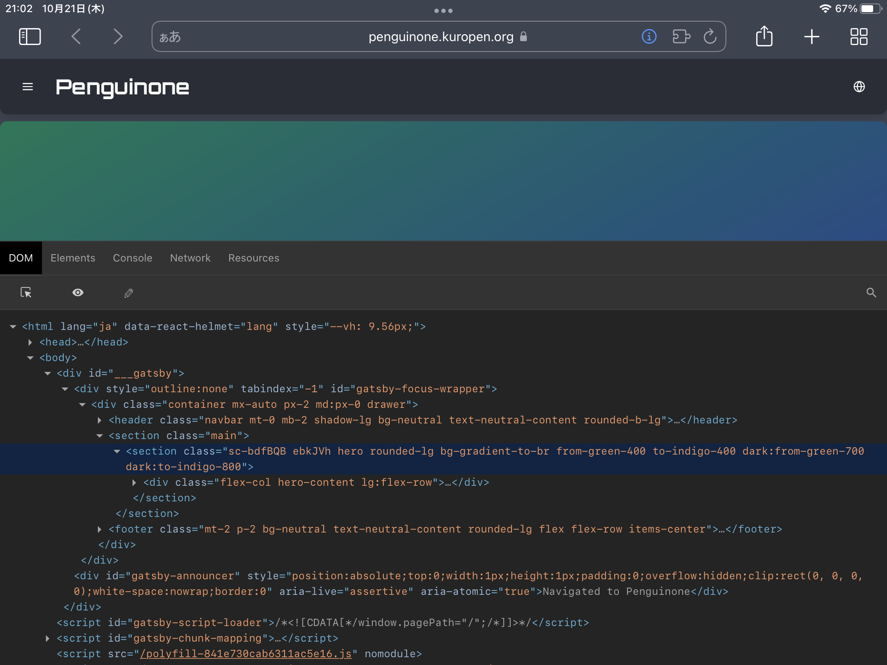

Macを持たない[^1]者にとって、WebアプリであってもiOSでの動作確認はかなりハードルが高い問題です。

しかし先日リリースされた iOS 15 でブラウザアドオンが拡充されたようで、
[実機画面で開発者ツールを表示できるアドオン](https://apps.apple.com/jp/app/web-inspector/id1584825745)が登場していました。

DOMツリーやconsole.logもきちんと表示できています。

Webアプリの実機検証が少し楽になる気がしました。

[^1]: かつては持っていましたが今は手放しています。
