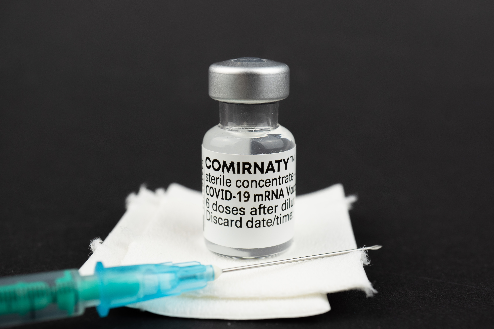

この記事に記載する内容は個人の感想であり、医療・医薬品に関する正確な情報を提供することを企図したものではありません。
なお、ワクチンに関する情報は<a href="https://www.mhlw.go.jp/stf/seisakunitsuite/bunya/vaccine_00184.html">厚生労働省</a>ならびにお住まいの自治体のWebサイト等でご確認ください。

<small>Photo by <a href="https://unsplash.com/@mbaumi?utm_source=unsplash&utm_medium=referral&utm_content=creditCopyText">Mika Baumeister</a> on <a href="https://unsplash.com/s/photos/vaccine?utm_source=unsplash&utm_medium=referral&utm_content=creditCopyText">Unsplash</a></small>

[9月23日の接種](/ja/posts/20210924-covid-19-vaccination-1st)から3週間が経った10月14日に2回目の接種を行いました。

ひとまず副反応が大事になることはありませんでしたが、大体以下のような感じです。

- 前回と違い、接種後すぐに肩の張りが起きるようなことはなかった。
- 翌日の15日から16日にかけて、最大37.6度の発熱
- それでも生活に支障はなかったので15日は普通にプログラミングやゲームをしていたが、夜に急な寒気がして、23時頃に布団を厚めに敷いて寝たら暑すぎて午前2時に目を覚ます

このあたりは個人の体質によるところも大きいとは思いますが、過度な心配をする必要はないのではないかと思います。

私が接種した会場である市営桜木駐車場は、私の2回目接種の翌週・10月24日に撤収となり、それ以外にも多くの地域で今月末ですべての接種が終了するとされています。
また、患者の数が減り、生活スタイルや勤務体制を元に戻す動きが広がっているようですが、元に戻すこと自体は私は否定しません。
ただ、油断のしすぎで後悔することのないようにしていきたいものです。
