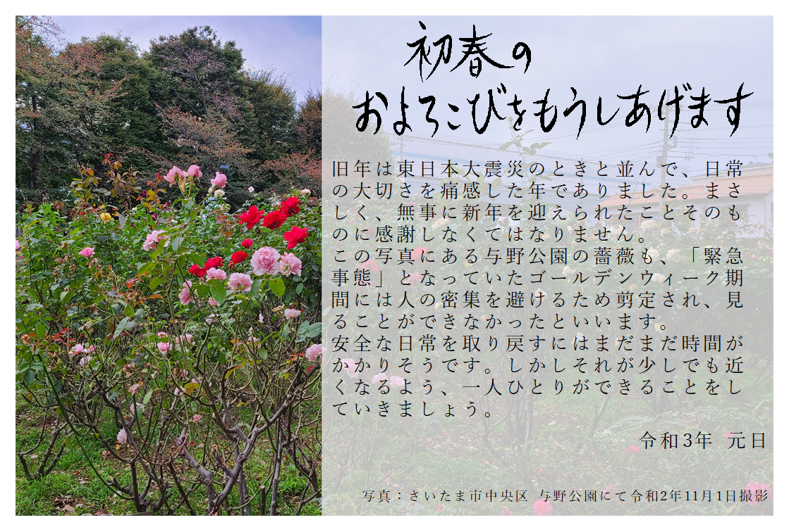

2021年になりました。今年もよろしくお願い致します。

### 本年の年賀状
2020年年始分は年賀状の製作を休みましたが、今年は製作したので掲載致します。

旧年は東日本大震災のときと並んで、日常の大切さを痛感した年でありました。まさしく、無事に新年を迎えられたことそのものに感謝しなくてはなりません。

この写真にある与野公園の薔薇も、「緊急事態」となっていたゴールデンウィーク期間には人の密集を避けるため剪定され、見ることができなかったといいます。

安全な日常を取り戻すにはまだまだ時間がかかりそうです。しかしそれが少しでも近くなるよう、一人ひとりができることをしていきましょう。

※この節の参考文献: [さいたま市／与野公園のバラの蕾(つぼみ)のせん定について](https://www.city.saitama.jp/002/001/008/006/004/010/p072119.html)

### 2020年の振り返り
所謂新型コロナウイルスは、国際的には「COVID-19」と呼ばれています。その名の通り2019年に確認されたものですが、中国を除いて問題化したのはこの2020年でした。春の訪れとともに感染が全国に拡大してしまい、春には「人との接触8割減」を掲げて緊急事態が宣言されました。これに関しては感染拡大の防止には寄与したという評価になっていますが、一方で経済的なダメージが大きかったと見られたのか、それを嫌ってか当時以上に深刻な2020年12月の現状でも再発動はなかなかされないという状況になっています。

そんな中個人的な話としては、身内の観劇の予定が1-2ヶ月に1回入っており、私自身は一人暮らしでも埼玉側自宅で家族で顔を合わせる機会も増えようかという当初の予定でしたが、1月まではその通りになったものの、2月の観劇予定が感染拡大で中止になり [^1] 以降はすべて流れました。

ただし、私には会津若松で登録され、与野に持ち込んでいる扱いになっている自家用車があるため、毎年6月・12月の定期点検と、12月の点検を行うための冬タイヤ着脱のため11月・3月には実家に戻る必要があります。この事情なども勘案した結果、実家に居住していない親戚との面会を極力回避する条件で、帰省は原則予定通り（1-2ヶ月に1回）行うこととしています。1回だけ、ゴールデンウィーク期間に予定されていた法事は性質上これを避けられないため帰省を見送りました。

仕事に関しては、2019年10月より週の半分を東京、もう半分を埼玉で行っていましたが、緊急事態宣言を契機に全日埼玉で仕事をすることになりそれが現在まで続いています。通勤時間が短くなったのは大変にありがたいことです。完全テレワークもできると言えばできるのですが、外に出る機会が減りすぎても不健康になるのでこれが一番丁度良いのかなと。

宴会などは私は2019年の職場の忘年会以来行っておりませんので、特に問題はありません。

このように、コロナ禍による私の生活への影響は、ありそうでない、という状況です。

プライベートでは、メインPCが新造の自作PCへと変わりました。想定されていた主な用途としては、Final Fantasy XIV, Cities:Skylines といったゲームのプレイですが、Folding@homeに参加することにしています。

旅行は御朱印集めなどは行っていますが、感染拡大局面では控えるか厳戒態勢での実施としています。

こういった趣味に関する発信も、2020年も同じようなことを言っていた気もしないでもないですが、2021年には強化できたらと思っています。

[^1]:[【2月27日（木）13:00開演】『ヘンリー八世』の払戻について](https://www.saf.or.jp/information/detail/8938/)
