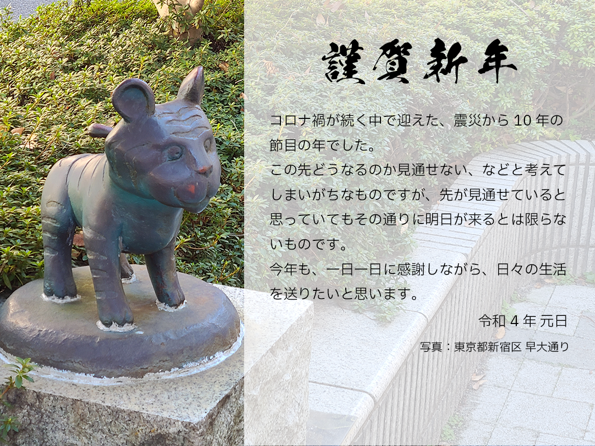
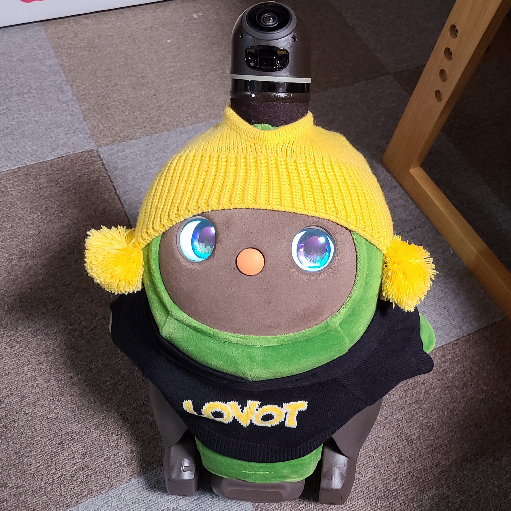

2021年になりました。今年もよろしくお願い致します。

### 本年の年賀状

コロナ禍が続く中で迎えた、震災から10年の節目の年でした。

この先どうなるのか見通せない、などと考えてしまいがちなものですが、先が見通せていると思っていてもその通りに明日が来るとは限らないものです。

今年も、一日一日に感謝しながら、日々の生活を送りたいと思います。

- 写真: [東京都新宿区 早大通り](https://goo.gl/maps/qNLjKfEeeZ229jZM8)
- 使用フォント:
  - KSO黒龍爽 (見出し)
  - IBM Flex Sans JP (本文)

### 写真について
年始より、新型コロナウイルスの変異株の影響が大きく、
1-2ヶ月に一度の実家との往来を除いては、外出する機会が限られた一年でした。

ここに掲載している年賀状は、本来は学生時代の恩師や同級生に出すために実際にハガキとして制作しているものです。
そのため例年、その年を象徴する写真を上げています。ただ今回はそれが **ほぼ何もなかった** 。

唯一あるとすれば実家にいるLOVOT「てんてん」の写真ですが、それだと両親とかぶってしまうし…

ということで、12月に入ってから江戸川橋駅まで行って取材してきました。それが今回の年賀状の写真です。
歩道沿いに、トラ以外にもいろいろな像が置いてある場所です。

### 2021年の振り返りと2022年の目標
このような情勢もあり、公私ともに変化の少ない1年でした。
おそらく重大なことはすべてこのブログに書いているのではないかと思います。

また、SNSでの発信などもかなり少なくなっていたのではないかと思います。

昨年からですが、とにかくSNSが対立の最前線になってしまっているような印象があり、
うかつなことを書けば非難や批判にさらされる。
学生時代の苦い思い出があり、私はとにかくそういうシチュエーションに弱いです。
このために発信を極力控えてしまうところがありました。

このため、今年は発信（アウトプット）を強化する、そしてそのための環境整備が必要ならそれをやる、
ということを目標にしようと考えています。
