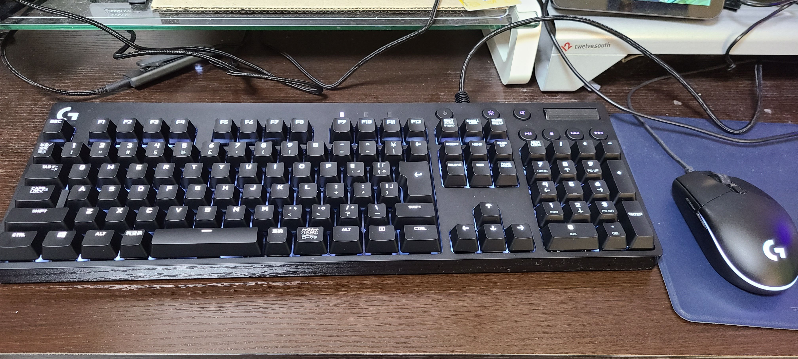
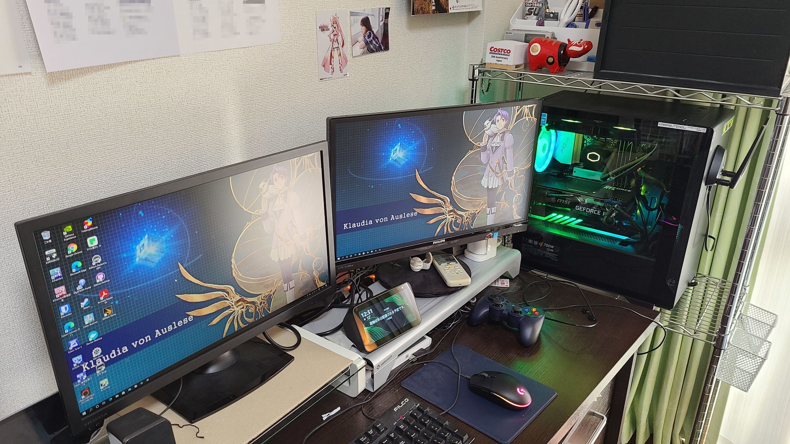

キーボードを新調しました。

新しいキーボードはLogicool G610 [^1] の青軸モデル。ゲーミングキーボードですがバックライトが白色のみというモデルです。
横に置いてあるとおり、マウスがロジクール製なのでそれに合わせた形になりました。

以前使っていたのはFILCOの黒軸キーボードでした。

これがいつから使っているかわからないほどの代物だったため、Amazonのタイムセール祭り [^2] を利用して交換に踏み切りました。

これまでとの違いといえばバックライトとクリッキー軸故の音です。

確かに音は気になるかも知れませんが、私はボイスチャットを常用する人間でもないので、まあしばらく使えば慣れるだろうと。

[^1]: [ロジクールG610 Orion Brownメカニカル キーボード（茶軸） (logicool.co.jp) ](https://gaming.logicool.co.jp/ja-jp/products/gaming-keyboards/g610-orion-keyboard.html) ※茶軸の商品紹介ですが軸違いで同じ商品です
[^2]: [Amazonタイムセール祭り開始。アプリ+キャンペーンでお得に - Impress Watch](https://www.watch.impress.co.jp/docs/news/1303531.html)
