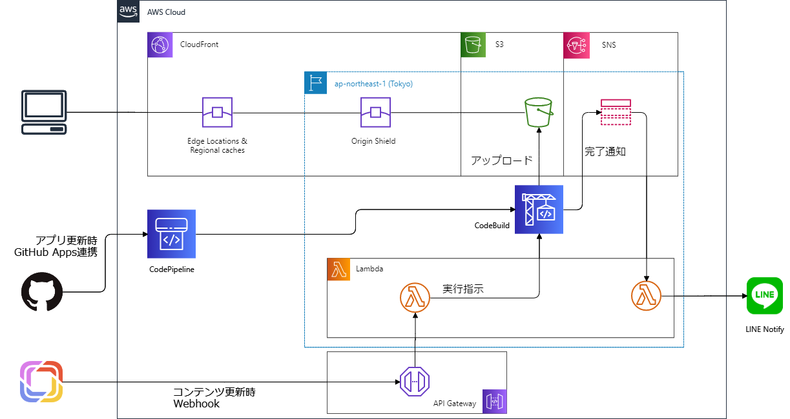

当サイトはこれまでNetlifyから配信していましたが、このたびAWSに移管しました。

この記事では、移管にあたって実施した事項の概略について記述します。なお、詳細につきましては[技術文書としてまとめました](https://zenn.dev/kuropen/articles/12c1203cc52139)。

### 移管の背景

これまで利用していたNetlifyのフリープランでは、サーバの所在地が限定されており、日本国内からのアクセスはシンガポール国内のサーバに転送されてしまいます。このためもあり、アクセスからページの表示までにやや時間がかかる状況が発生していたため、AWSに再構築を行いました。

### ステップ1: CloudFrontの構築
はじめに、高速化策の検証と、それが不十分であった場合のAWS移管の準備のため、CloudFrontディストリビューションを準備し、DNSレコードをそちらに向ける作業を実施しました。

結果、多少の高速化は図れましたが、依然として読み込みに数秒かかる状況であったため、AWS移管を実施することとしました。

### ステップ2: AWS環境の構築

従来のNetlifyと同様の環境を構築するために、以下を実施し、2月4日夜より運用を開始致しました。

- GitHubからCodePipelineでソースコードを取得する設定
- CodeBuildでGatsbyJSのコードをHTML化し、S3にコピーする設定
- CloudFrontのコンテンツ取得先を、上記でコピー対象となるS3バケット（静的Webページ公開機能）に変更
- Prismic CMSからのWebhookを受け入れるため、CodeBuildを実行するLambda関数およびそれに対するAPI Gatewayのエンドポイントを作成
